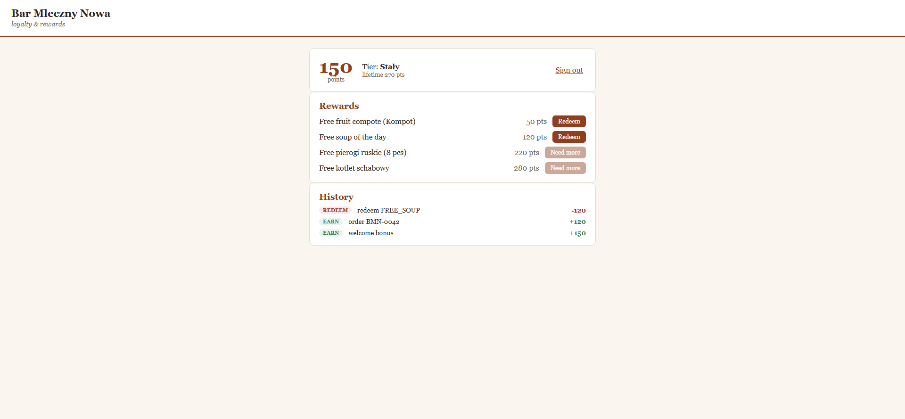

# restos-portal

Customer loyalty & rewards backend for the RestOS ecosystem: JWT auth with roles, a points
ledger with tiers, and reward redemption — NestJS 11 + Prisma, running on zero-setup SQLite by
default (swap `DATABASE_URL` for Postgres).


[](https://github.com/arcsymer/restos-portal/actions/workflows/ci.yml)


Demo evidence: [docs/demo-transcript.md](docs/demo-transcript.md) — a real request/response
session (register → earn → redeem → 403/429).

## Quickstart

Prerequisites: **Node 22+** and **pnpm 9+** — nothing else (SQLite file DB, no accounts, no paid
services).

```sh
git clone https://github.com/arcsymer/restos-portal && cd restos-portal
cp .env.example .env   # Windows cmd.exe: copy .env.example .env
pnpm install           # postinstall runs `prisma generate`
pnpm run db:setup      # applies migrations + seeds the rewards catalog & demo users (SQLite)
pnpm start
```

- Swagger UI: <http://localhost:3000/docs> · health: <http://localhost:3000/health>
- Seeded demo logins (password `password123`): `anna@example.com` (customer, 150 pts),
  `staff@example.com` (staff).

Example: log in, then read your loyalty account.

```sh
curl -s -X POST localhost:3000/auth/login -H "Content-Type: application/json" \
  -d "{\"email\":\"anna@example.com\",\"password\":\"password123\"}"
# → { "accessToken": "...", "refreshToken": "..." }
curl -s localhost:3000/me/account -H "Authorization: Bearer <accessToken>"
# → { "balance": 150, "lifetimePoints": 150, "tier": "nowicjusz" }
```

## Web dashboard (`web/`)

A small React 19 + Vite front for customers — sign in, see balance/tier/history, redeem rewards.
It proxies to the API on `:3000`.

```sh
cd web && pnpm install && pnpm dev    # http://localhost:5173 (API must be running)
```



## Architecture

```mermaid
flowchart LR
    C[client / Swagger] -->|JWT| API[NestJS /api]
    API --> AUTH[auth: register/login/refresh\nbcrypt + access/refresh JWT]
    API --> LOY[loyalty: account, ledger, rewards,\nredeem, staff earn]
    subgraph guards[global guards]
      THR[Throttler] --> JWTG[JwtAuthGuard] --> ROLE[RolesGuard]
    end
    API --- guards
    LOY --> DB[(Prisma → SQLite default\n| Postgres via DATABASE_URL)]
```

Global cross-cutting: `ValidationPipe` (whitelist DTOs), `ThrottlerGuard` (tight on `/auth/login`),
`JwtAuthGuard` (`@Public()` opt-out), `RolesGuard` (`@Roles('staff')`), a cache on the rewards list.

## Features

1. **JWT auth** — register / login / refresh, bcrypt hashing, access + refresh tokens.
2. **Roles** — `customer` / `staff` via a guard; staff-only endpoints (e.g. crediting points).
3. **Points ledger** — append-only earn/redeem entries; balance is their sum; tiers
   (`nowicjusz` → `staly` → `klub`) derived from lifetime points.
4. **Redemption** — redeem a reward from the seeded catalog if the balance covers it (else 400).
5. **Rate limiting + caching** — global throttler with a tight per-route limit on login;
   cache-manager on the rewards catalog.
6. **OpenAPI + validation** — Swagger UI, class-validator DTOs, consistent error codes.
7. **Prisma persistence** — migrations + seed; SQLite default, Postgres via `DATABASE_URL`.

## Testing & CI

```sh
pnpm run test          # unit (jest)
pnpm run test:e2e      # supertest e2e — full flow incl. 401/403/400/409/429
pnpm run lint:ci
```

CI runs migrate + seed on a fresh SQLite DB, then build + lint + unit + e2e + gitleaks.

## Product notes

See [PRODUCT.md](PRODUCT.md) — user stories, success metrics, and an experiment plan.

## Limitations

- No email verification or password reset; refresh tokens aren't rotated/revoked (stateless JWT).
- Points are credited via a staff/system endpoint — there's no live order→points webhook from
  restos-core yet (a cross-service v2 idea).
- SQLite by default is single-file; for real concurrency use the Postgres `DATABASE_URL`.
- All data is synthetic; demo credentials are public and for local use only.

## License & attribution

MIT — see [LICENSE](LICENSE). Part of the [RestOS](https://github.com/arcsymer) portfolio.

Built end-to-end with an agentic workflow (Claude Code), orchestrated, reviewed, and directed by me.
